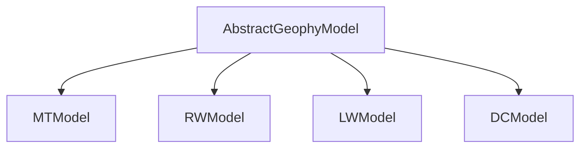

# PrISM.jl : Introduction

## Structure

All the models are a subtype of the abstract type `AbstractGeophyModel`, and their corresponding responses, outputs of the forward calls, are subtypes of the abstract type `AbstractGeophyResponse`.

The current framework provides a few models :

Each of these model types has a parameter `m`, that specifies the physical property of the medium the method is sensitive to, e.g., electrical resistivity for magnetotelluric `MTModel` and shear wave velocity for Rayleigh waves `RWModel`. This is the parameter that is natively inverted for in the inversion schemes provided in the package. Each model type also has a parameter `h` that defines the grid-size. In 1D, this corresponds to layer thicknesses. Some models such as `RWModel` also require P-wave velocities and densities alongside the usual parameters. These are again constant parameters, and not inverted for.

## Modeling

Calculation of forward responses can be done by calling the `forward` function on the corresponding geophysics models, along with the necessary survey specifications, e.g., frequencies for `MTModel` and `RWModel`. Specific pages for the models provide an introduction along with example to demonstrate forward calls.

## Initial parameters

Some geophysical models also require parameters that are essential for the numerical recipes of the forward models. While we provide default values for these models, you can easily change these values. Surface wave models are a good example of this, and the user is recommended the corresponding introduction pages ([Rayleigh waves](../models/rayleigh.md), [Love waves](../models/love.md)).

## Bounds transformation

The objective of geophysical inversion is to obtain estimates of the physical properties. The geophysical inversion, being ill-posed, can be very unstable and highly challenging. The most common strategy is to perform inversion in a space that is constrained so that the inversion scheme does not assume any unrealistic values. An intuitive example is using log-space for electrical resistivities. Since the electrical resistivity in the subsurface spans orders of magnitude, the inversion is well-behaved in the log-space. Moreover, the guarantee that the electrical resistivity will always be positive comes for free.

You may want to further constrain this space, e.g., the shear wave velocities should be between 3 and 4.5 $km s^{-1}$. Such constraints are easily imposed by performing inversion in a domain where such constraints are automatically satisfied. We provide numerous such transformations to constrain the space. We provide a good demonstration of the same in the deterministic inversion of [Rayleigh wave model](../deterministic_inverse/nlsolve.md#Rayleigh-waves).

## Mutating operations

We provide mutating versions of the forward calls as well. These functions allocate less memory and, therefore, are more efficient. The forward calls of the geophysical methods are reasonably computational and there is not much speedup obtained because of these mutations.
